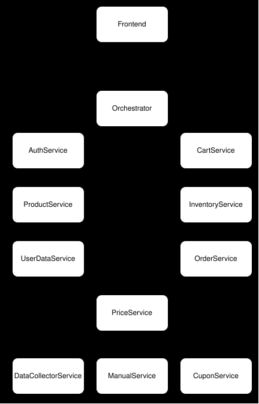
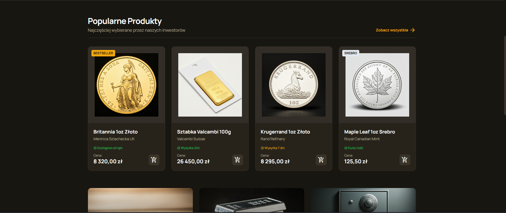
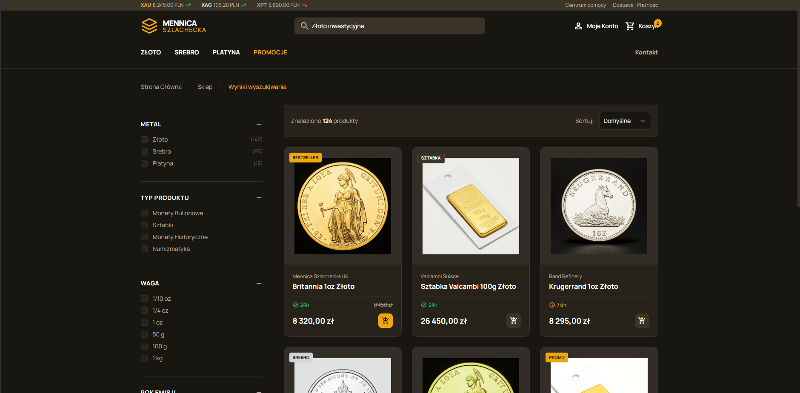
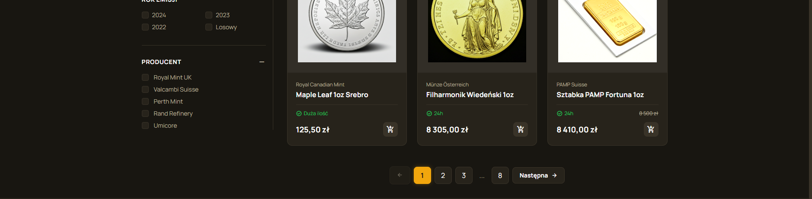

# Objective 

    Purpose of this HLD is to create new web app
    with backend for new 'silverShop' company,
    and to learn multiple things related to programming.

# Background

    Right now most silver and gold selling companies must decide between
    setting price on their website by hand or by adding some margine over spot
    price. I would like to extend this even more by additionaly analyzing
    prices of others companies. Of course setting price by hand is also very
    important, so we need to have switch what kind of (or when) pricing we
    want to use. Additionaly if someone wants to buy from us, then we have
    to nice looking website and backend that will allow us to store and
    manage our goods. Entire app should be created on microservices.

# Design

## Overview

    This HLD will try to cover everything, but for more details check
    each coresponding LLD. We can right now specifies FEA like:

### Backend

- Create orchestrator (managing all endpoints)
- Create authService (authorization and authentication)
- Create userDataService (user data info)
- Create productService (static info about coin)
- Create inventoryService (info about current quantity of good in our inventory)
- Create cartService (storing user cart on our end)
- Create manualService (setting price by hand and restirctions)
- Create dataCollectorService (get spot price, get data from others shops. All async)
- Create cuponService (creating cupon, validation)
- Create priceService (orchestrator of price flow)
- Create orderService (creating order for our goods)

### Frontend

- Create ui design for frontend elements
- Create basic main onepage
- Create authentication flow
- Create worker flow
- Create goods search
- Create cart flow

### Backend Services

## Functional Requirements

### Frontend

- User can register / login on website
- JWT http only authentication
- Workers have their own menu, where they can modify goods
- User can view products (pagination and filtering)
- User can see quantity, our price and min/max of other shops
- User can add things to cart. LocalStore and cartService.
- Going into cart validate price and quantity
- User can create order
- Admins can create cupons and users can use them
- Users have history of their orders

### Backend

- User can register / login / me on authService
- User can get their info on userDataService
- User can view static info of product on productService
- User can view quantity of product on inventoryService
- Admin can set price / restraint on manualService
- Admin can create cupons on cuponService
- DataCollectorService downloads prices from other shops and calculate price for our items
- User can get price via PriceService and additional info like gold and silver price and min/max price from other shops.
- CartService remember logged user cart
- OrderService can create orders

## Non Functional Requirements

- Test driven development
- CI/CD using github actions
- Metrics using prometheus
- JWT http only
- Using Docker for single microservice
- Using Kubernetes for entire project

## Technology Stack
- Backend springboot with java
- Frontend react with typescript
- Orchestrator should be written in camel way of springboot

## Service Responsibilities

### Orchestrator
    Responsibility:
    - Accept REST communication from frontend
    - Validate JWT
    - Manage traffic
    Data:
    - No
    API:
    - REST from frontend
    - GRPC to backend
    Dependencies:
    - AuthService
    - ProdutcService
    - InventoryService
    - PriceService
    - CartService
    - UserDataService
    - OrderService

### OrderService
    Responsibility:
    - Manage user orders
    Data:
    - Database with orders
    API:
    - GRPC
    Dependencies:
    - InventoryService
### CartService
    Responsibility:
    - Manage cart of logged user
    Data:
    - Database with items in cart per user
    API:
    - GRPC
    Dependencies:
    - InventoryService

### InventoryService
    Responsibility:
    - Manage non static data of products
    Data:
    - Database with info about products
    API:
    - GRPC
    Dependencies:
    - NO

### ProductService
    Responsibility:
    - Manage static data of products
    Data:
    - Database with info about products
    API:
    - GRPC
    Dependencies:
    - No
### AuthService
    Responsibility:
    - Register, login and me users
    - Generate JWT
    Data:
    - Database with user login, password and rank
    API:
    - GRPC
    Dependencies:
    - No

### UserDataService
    Responsibility:
    - Manage user person data
    Data:
    - Database with user personal data
    API:
    - GRPC
    Dependencies:
    - No

### ProductService
    Responsibility:
    -
    Data:
    -
    API:
    -
    Dependencies:
    -

### CuponService
    Responsibility:
    - Generate cupons
    - Validate cupons
    Data:
    - Database
    API:
    - GRPC
    Dependencies:
    - No

### DataCollectorService
    Responsibility:
    - Generate cupons
    - Validate cupons
    Data:
    - Database for managing prices of other shops
    - Cache for storing calculated price of goods TTL5min
    - Cache for storing fetched silver and gold spot price
    API:
    - GRPC
    Dependencies:
    - Other shops
    - Silver and gold spot price

### ManualService
    Responsibility:
    - Setting price by hand
    - Managing min and max price
    - Logic if using price from dataCollector
    Data:
    - Database
    API:
    - GRPC
    Dependencies:
    - No

### PriceService
    Responsibility: 
    - Calculate price
    - Manage cupons
    Data:
    - No database, only cache
    API:
    - GRPC
    Dependencies:
    - DataCollectorService
    - ManualService
    - CuponService

# Frontend design

### Main page

### Find page

