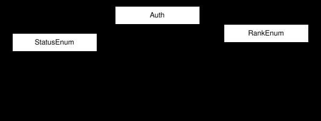
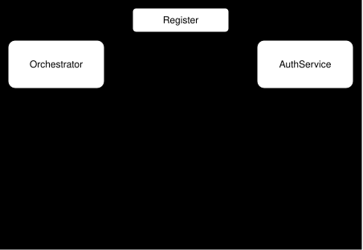
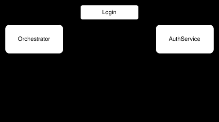
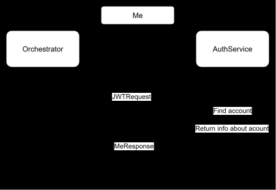

# AuthService

    Purpose of this service, is to register, authenticate and authorize of users.

## Functional Requirements
- User can register new account
- User can login
- Generate JWT http only
- Orchestrator can ask for info about user from JWT
- Account can have rank
- Account can be blocked

## Non Functional Requirements
- Communication via GRPC

# Database

# GRPC Service

    AuthService should expose AuthService GRPC Service with:
    rpc Register(RegisterRequest) return JWTResponse
    rpc Login(LoginRequest) return JWTResponse
    rpc Me(JWTRequest) return MeResponse

# GRPC Data

    RegisterRequest
    string: login
    string: password

    LoginRequest
    string: login
    string: password

    JWTRequest
    string: token

    JWTResponse
    string: token
    int64: expiresAt

    MeResponse
    string id
    string login
    string rank

# GRPC Errors

- ALREADY_EXISTS
- NOT_FOUND
- INVALID_ARGUMENT
- UNAUTHENTICATED

# Flow

## Register Flow

## Login

## Me

